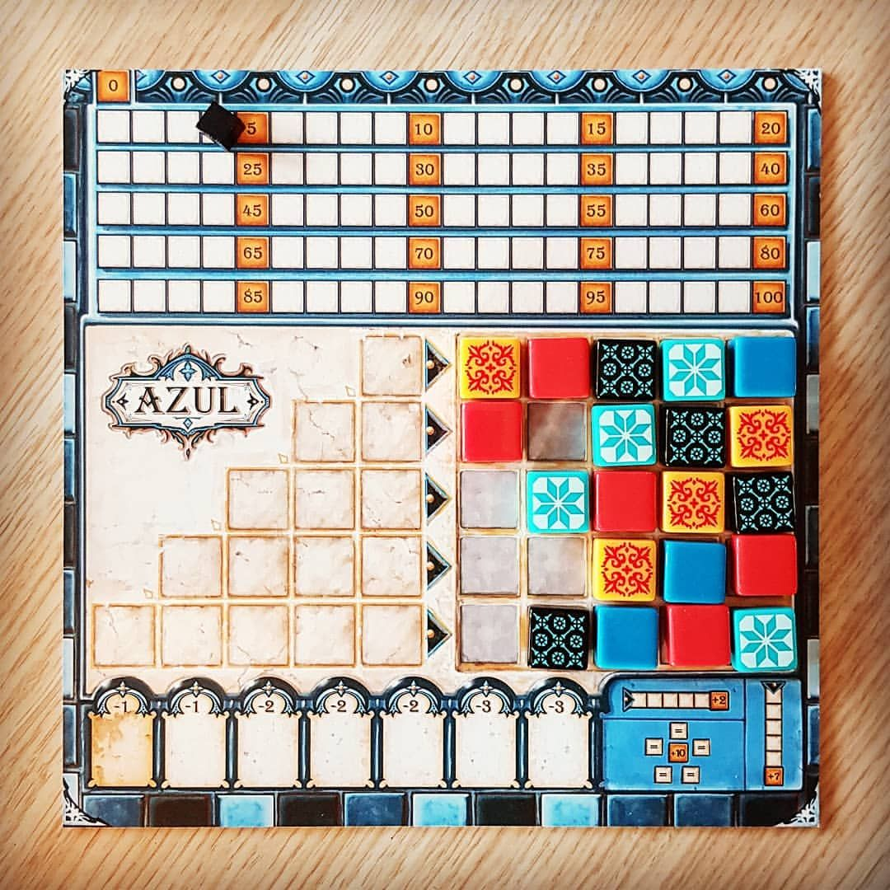
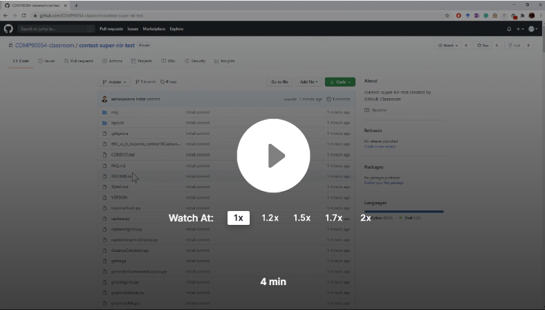
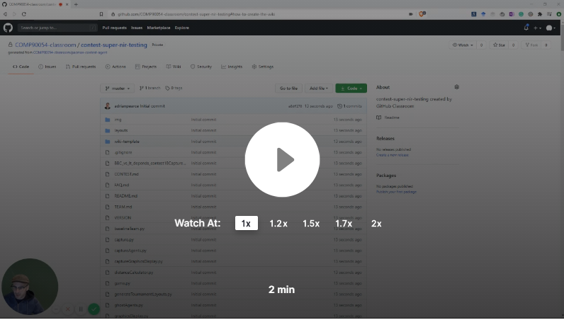

# Assignment 3: Azul Project

You must read fully and carefully the assignment specification and instructions detailed in this file. You are NOT to modify this file in any way.

* **Course:** [COMP90054 AI Planning for Autonomy](https://handbook.unimelb.edu.au/subjects/comp90054) @ Semester 1, 2023
* **Instructor:** Tim Miller and Nir Lipovetzky
* **Deadline Team Registration:** Monday 1 May, 2023 @ 18:00 (start of Week 9)
* **Deadline Preliminary Submission:** Monday 8 May, 2023 @ 18:00 (start of Week 10)
* **Deadline Wiki report, video & final Submission:** Monday 22 May, 2023 @ 18:00 (start of Week 12)
* **Course Weight:** 35% total, comprising 5% (preliminary competition) + 10% (final competition) + 5% (video) + 15% (Wiki)
* **Assignment type:**: Groups of 3 (not 2 or 4!)
* **Learning outcomes covered:** 1-5

 <p align="center"> 
    
 </p>
 
The purpose of this project is to implement an autonomous agent that can play the game Azul and compete in the UoM COMP90054-2023 Azul competition:

 **Please read carefully the rules of the [Azul game](https://www.ultraboardgames.com/azul/game-rules.php)**. Azul can be understood as a deterministic, two-player game. Understanding the results and different strategies is important for designing a good agent for this project. Additional technical information on the contest project and how to get started can be found in file [azul.md](Azul/azul.md). 

### Table of contents

  * [1. Your tasks](#1-your-tasks)
     * [Important basic rules](#important-basic-rules)
  * [2. Deliverables and submission](#2-deliverables-and-submission)
     * [Preliminary submission (Monday week 10)](#41-preliminary-submission)
     * [Wiki and Final submission (Monday week 12)](#42-wiki-and-final-submission)
     * [Video (Wednesday week 12)](#video-wednesday-week-12)
     * [Self reflection (Thursday week 12)](#self-reflection-thursday-week-12)
  * [3. Pre-contest feedback tournaments](#3-pre-contest-feedback-tournaments)
  * [4. Marking criteria](#4-marking-criteria)
  * [5. Important information](#5-important-information)
     * [How to create the Wiki](#how-to-create-the-wiki)
     * [Corrections](#corrections)
     * [Late submissions &amp; extensions](#late-submissions--extensions)
     * [About this repo](#about-this-repo)
     * [Academic Dishonesty](#academic-dishonesty)
  * [6. COMP90054 Code of Honour &amp; Fair Play](#6-comp90054-code-of-honour--fair-play)
  * [7. Conclusion](#7-conclusion)
     * [Acknowledgements](#acknowledgements)


## 1. Your tasks


**Your first task** is to get into a team, add all team members to the team repository, and register your team's details on the [Project Contest Team Registration Form](https://forms.office.com/r/AtJXC1eMr0)

**Your second task** is to get familiar with the code by developing an simple agent based on any one of the techniques listed below. This is an **individual** task. By completing this task, your teams should be able to have 3 or 4 decent agents to play with each other. In addition, each team member should understand more about the game and code.

> :loudspeaker: 
You may want to look at the file [`agents/t_XXX/example_bfs.py`](agents/T_XXX/example_bfs.py), which contains a simple agent that is using BFS and selects the first moved from the plan (if it find any) given a goal function (currently empty).

**Your third task** is to develop an autonomous agent team to play Azul by suitably modifying file [`agents/t_XXX/myTeam.py`](agents/t_000/myTeam.py) (and maybe some other auxiliarly files you may implement). The code submitted should be internally commented at high standards and be error-free and _never crash_. 

Over the course of the project, you must try at least **least 3 AI-related techniques** (or fewer/more if your team ends up with 2 or 4 members due to unenrolments, etc. -- one technique per team member) that have been discussed in the subject or explored by you independently. You can try three separate agents with different techniques, or you can combine multiple techniques into a  single agent. **We won't accept a final submission with less than 3 techniques**. Some candidate techniques that you may consider are:

1. Blind or Heuristic Search Algorithms (using general or domain-specific heuristic functions).
2. Classical Planning (PDDL and calling a classical planner).
3. Policy iteration or Value Iteration (Model-Based MDP).
4. Monte Carlo Tree Search or UCT (Model-Free MDP).
5. Reinforcement Learning – classical, approximate or deep Q-learning (Model-Free MDP).
6. Goal Recognition techniques (to infer intentions of opponents).
7. Game Theoretic Methods such as multi-player MCTS/reinforcement learning and backward induction.

Using the search algorithm with a different heuristic do NOT count as a separate technique.

You can  use hand-coded approaches like decision trees to express behaviour specific to the game, but they do NOT count as a required technique for this subject because we are learning about generalised techniques for *autonomy*. The techniques mentioned above can cope with different games and minor changes to games better than any hand-coded techniques like decision trees or if-else rules. 

If you decide to pre-compute a policy, you can save it into a file and load it at the beginning of the game, as you have 15 seconds before every game to perform any pre-computation.

Together with your actual code solution, you will need to develop a **Wiki** report, documenting and describing your solution and a 5-min recorded video will also be required, see below.

**Your fourth task** is to write a short individual reflection and evaluation, along with a self assessment of your performance in the team.
 
### Important basic rules

When submitting a solution, please make absolutely sure you adhere to the following rules:

* Please commit your own code with your **own GitHub account**. This is extremely important as the teaching team might use your commit history to evaluate your code contribution in the group.

* All your code should be in your submission directory (`agents/t_XXX/`). *XXX* in **t_XXX** should be replaced with your Canvas Team id. It should be exact three digits starting with 0. For example, if your team name in the Canvas is "Canvas team 1", then you should create a new folder in your repo with directory as "`agents/t_001/`" and put all your code there.

* Your code **must run _error-free on Python 3.8+**. Staff will not debug/fix any code. If your code crashes in any execution, it will be disqualified from the contest. We provide docker config for you to test your code in the same docker environment that servers run, which you can find instructions in [azul.md](Azul/azul.md) In addition, we might add more packages to the [requirements.txt](docker/requirements.txt) daily based on request. You can either find it in the [public template repo](https://github.com/COMP90054-2023S1/A3_public_template.git) or in the ED [announcement](https://edstem.org/au/courses/10995/discussion/1319814). 
Please enable force-rebuild to make sure your local docker image is up-to-date if you updated requirement.txt, which you can find details in [docker_instruction](docker/README.md).

You are able to test the server environment locally by this command in your repo directory:
```bash
bash docker/docker_runner.sh
```

* You can assume the following packages are installed on our server:

   func-timeout==4.3.5

   numpy==1.19.5
   
   GitPython == 3.1.17
   
   pytz==2022.1
   
   dataclasses==0.6
   
   tensorflow==2.7.1
   
   keras==2.7.0
   
   scikit-learn==1.0.2
   
   scipy==1.8.0
   
   torch==1.11.0
   
   lapkt==0.1.1

* Your code **must not contain any personal information**, like your student number or your name. If you use an IDE that inserts your name, student number, or username, you should disable that.

* You are **not to change or affect (e.g., redirect) the standard output or error channels** (`sys.stdout` and `sys.stderr`) beyond just printing on standard output. If your file mentions any of them it will be breaking the "fair play" of the course (see below). These are used to report each game output and errors, and they should not be altered as you will be interfering negatively with the contest and with the other team's printouts. 

* Being a group assignment, you must **use your project Github** repository and GitHub team to collaborate among the members. The group will have write access to the same repository, and also be members of a GitHub team, where members can, and are expected to, engage in discussions and collaboration. Refer to the marking criteria below. 

> :loudspeaker: 
 It is important that *all* members of the team use the repository and commit their code. If there are disputes about the amount of contribution between the team, we will assume that the code checked into the repository is written by the team member who checked it in.

## 2. Deliverables and submission

There will be two code submissions for this project, one video, one group report, and one individual reflection.

### Team Registration: Monday 1 May, 2023 @ 18:00 (start of Week 9)

Please registry your team by submitting [Project Contest Team Registration Form](https://forms.office.com/r/AtJXC1eMr0)

### Preliminary submission (individual): Monday 8 May, 2023 @ 18:00 (start of Week 10)

In the **preliminary submission**, you are to:
 
1. Submit your first working version of your solution, by tagging a commit in the team repository using you **student ID** as the tag name.
2. All your files should be in your submission directory (`agents/t_XXX/`). The file `agents/t_XXX/myTeam.py` should contain your AI-based agent as the individual agent for performance evaluation. We would highly recommend using your **own branch** for this task so that team members do not accidentally make changes to each others' agents.
3. We will clone your tag and run your code against a random player for 5 games. Your mark will be the number of games that your agent won.
4. **Please use your own github account to commit your code.** Otherwise, you would not be able to get marks.
5. Please make sure the commit in your submitted (tag) is your own original work. 


### Wiki and final code submission (group):  Monday 22 May, 2023 @ 18:00 (start of Week 12)

In the **final group submission** (23:59 Monday 18th October, Week 12) you are to submit your final submission to the project, which includes:


1. All your files should be in your submission directory (`agents/t_XXX/`). The file `agents/t_XXX/myTeam.py` should contain your AI-based agent as the final team agent for playing in the competition.
2. A **Wiki** in your GitHub team repository, documenting and critically analysing your agent. 
    * Take a look at the **Wiki** provided as a guideline of the structure that you should follow.
    * At the very minimum the Wiki should describe the approaches implemented, a small table/graph comparing the different agents/techniques you tried showing their performances in several scenarios (briefly the table), and an analysis of the strengths and weaknesses of your solution. For example, you may want to show how the addition of a given technique or improvement affected your system at some important point in the development. 
    * However, you can also discuss other aspects, such as other techniques you experimented with (and why they were not used in the final system), future extensions or improvements on your system, etc.
3. A **Video (recorded 5-minute oral presentation)** that:
    * outlines the theoretical or experimental basis for the design of your agents (i.e. why you did what you did), challenges faced, and what you would do differently if you had more time. 
    * Your presentation must end with a live demo of your main different implementations, i.e. showing how the different techniques your tried work with some description and analysis.
    * The video will be shared with us through an unlisted youtube link at the top of the **Wiki** of your GitHub repository.
    * Please make sure your video is no longer than 5 minutes.
    * Please do not just speed up the video to fit it into 5 minutes -- the time limit is intended to get you to think  hard about what is important.
4. Please tag your commit with the exact tag name `submission`. 
5. A filled [Project Certification & Contribution Form (FINAL)](https://forms.office.com/r/rKQ4iM7eGj)
> :warning: Each member of the team should fill a separate certification form. Members who do not certify will not be marked and will be awarded zero marks.

Submit your project substantially before the deadline. Submitting close to the deadline could be risky and you may fail to submit on time, for example due to loss of Internet connection or server delays. There will be **no extensions** based on these unforeseen problems. 

### Individual reflection: Thursday 25 May, 2023 @ 18:00 (end of week 12)

Each team member submits a short (one page maximum) PDF individual reflection to Canvas (under Assignments) that answers the following questions:
 
1. Details: team number, link to your team Wiki.
1. What was the best aspect of my performance in my team?
1. What is the area that I need to improve the most?
1. A self evaluation that includes how many marks you have earnt in this group project. Your self evaluation should consider:
   * 15 marks for the code submission for your team (not the individual submission) and Wiki report
   * 5 marks for the video (5 marks)
   For the self-evaluation, you should consider the following:
   * **Teamwork**: whether you contributed meaningfully to your team, whether you did what was asked, whether you followed good teamwork and software engineering principles.
   * **Technical contribution**: whether you implemented code that was useful to your team; e.g. it was part of the tournament, it was useful for running comparisions, etc.
   * **Written contribution**: whether you contributed to clear and concise additions to the wiki and video
   * **Learning**: What did I learn about working in a team? What did I learn about artificial intelligence?

### Q&As
* How to import other customized python files?
    * You can import with `agents.t_XXX.your_python_file_name`
* Where to save or load your local files?
    * You can open your local files with a complete relative path: `agents/t_XXX/your_file_name`. Please **do not** use `sys.path.append('agents/t_XXX/')`, which could potentially leak your path to your opponents (yes, this has happened in the past).


## 3. Pre-contest feedback tournaments

We will be running **informal tournaments** based on preliminary versions of teams' agents weeks before the final project submission.

Participating in these pre-contests will give you **a lot of insight** on how your solution is performing and how to improve it. Results, including replays for every game, will be available only for those teams that have submitted. 

You can re-submit multiple times, and we will run the version tagged `test-submission`. These pre-contest tournaments are just designed for continuous feedback for you to  debug and improve your solution! You do not need to certify these versions.

We will try to run these pre-competitions frequently. The addition information about this can be found on ED later.


## 4. Marking and evaluation criteria

As with assignments 1 and 2, we will be using an ungrading approach, but this time with some differences. Notably, for the code performance, we will use **contract grading**, where you earn marks by being able to beat staff teams of varying ability in the contest.


The overall project marks (worth 35% total of the subject) are as follows:

| Component | Course Weight |
| ----------| --------------|
| Performance of the preliminary submission (auto-graded)    | 5% |
| Performance of the final submission (auto-graded)           | 10% |
| Quality of Wiki and types of techniques used  (self graded) | 15% |
| Quality of Video and types of techniques used (self graded) | 5% |
| **Total** | **35%** |

### 4.1 Preliminary submission

Each person's individual submission will play five games against the [random agent](agents/generic/random.py). A mark will be awarded for every game that the agent beats the random agent.

### 4.2 Contest
In the final submission, a contest will be run using more than many games to judge the performance of each team. In the final submission (if times allows), the top-8 will enter into a playoff series to play quarterfinals, semi-finals and finals, time permitting live in the last day of class or in week 13 (once classes have finished) in a day specified for that (these final phases will not be part of the marking criteria, just awards for boasting!). The **performance** of your agent will be evaluated based on your ELO score.

### 4.2 Wiki

For your Wiki, when evaluating your performance and contribution, you should consider your contribution to the following quality criteria:

- **Design**: A clear written description of the design decisions made, approaches taken, challenges experienced, and possible improvements. Do not describe generic algorithms, but tell us how you used them. Take a look at the template of the wiki.
-  **Evaluation:** An experimental section that justifies and explains the performance of the approaches implemented, including a table of results comparing the approaches implemented followed by a discussion.

Note, each individual does not need to write in all parts of the report: people  can contribute more to experiments and less on coding agents for example. However, each team member should at least be designing and evaluating their own agents.

### 4.3 Video

For the video,  when evaluating your performance and contribution, you should consider your contribution to the following quality criteria:

- **Design**: A clear presentation of the design decisions made, challenges experienced, and possible improvements. 
- **Demo**: A demo of the different agents implemented across a variety of scenarios, showcasing pitfalls and benefits of each approach. No need of full game demo, just edit interesting parts and explain your insights.

Each team member should present in the video, roughly an equal amount.

### 4.4 Teamwork and Software Engineering professional practice

Besides the correctness and performance of your solutions, you must **follow good and professional software engineering practices**, including good use of git and professional communication during your development such as:

* _Commit early, commit often:_ single or few commits with all the solution or big chunks of it, is not good practice.
* _Use meaningful commit messages:_ as a comment in your code, the message should clearly summarize what the commit is about. Messages like "fix", "work", "commit", "changes" are poor and do not help us understand what was done.
* _Use atomic commits:_ avoid commits doing many things; let alone one commit solving many questions of the project. Each commit should be about one (little but interesting) thing. 
* _Use the Issue Tracker:_ use issues to keep track of tasks, enhancements, and bugs for your projects. They are also a great way to collaborate in a team, by assigning issues and discussing on them directly. Check GitHub [Mastering Issues Guide](https://guides.github.com/features/issues/).
* _Follow good workflow:_ use the standard branch-based development workflow, it will make your team much more productive and robust! Check GitHub [Workflow Guide](https://guides.github.com/introduction/flow/). 
* _Communicate in the GitHub Team:_ members of the group are expected to communicate, in an adequate and professional way, in the GitHub team created along the repo. For example, you could use GitHub team discussions, use issues and pull requests to track development status, or create project plans. Video and voice chats outside of GitHub are permissible (and encouraged), but text communication should be through the GitHub team where possible.

   [](https://www.loom.com/share/a1973a551a0142d5928ecab44d66ccaf)

* _Pair program_ when it is suitable. You can use VScode and [this extension](https://docs.microsoft.com/en-us/visualstudio/liveshare/use/vscode) to liveshare your local code with your team members as guests. In pair programming, take turns at who's hosting the session (driving the coding) and who's observing. Alternatively, use any online platform to share your screen and program with your team members. Pair Programming is a widely used practice in industry. it is known to reduce errors, improve code quality, improve learning of all members, and reinforce the quality of the team's communication. See this entry about [pair programming](https://en.wikipedia.org/wiki/Pair_programming)

We will also inspect the **commit history** and **GitHub team** to check for high-quality SE practices and meaningful contributions of members. We need to make sure that you work as a team where everyone is contributing. This is a key skill in industry. 

“Effective teamwork begins and ends with communication.” — Mike Krzyzewski.


## 5. Important information

### Dealing with the difficulty of Azul

You will quickly find that implementing search and learning agents is really hard for games. Here are some resources in the reinforcement learning ebook that may help you for both search and learning agents:

* [Modelling and abstraction for single-agent MDPs](https://gibberblot.github.io/rl-notes/single-agent/modelling-and-abstraction.html)
* [Modelling and abstraction for multi-agent games](https://gibberblot.github.io/rl-notes/multi-agent/modelling-and-abstraction.html)

These two sets of resources give types on how to increase the efficiency of your search/learning by changing the problem that you are solving. As noted in the [agents/t_XXX/example_bfs.py](agents/t_XXX/example_bfs.py), you can take the source code from the simulator and create your own simplified game that is easier to solve, and then use that information to play. E.g. one simple technique that sometimes works is to ignore your opponents moves all together, which reduces the branching factor and allows you to search further ahead. That may not work in every game (it would be terrible in chess), but it would be useful in SOME games.


### How to create the Wiki

You can use the template given in [wiki-template/](wiki-template/) folder in order to create your wiki. Watch the video below.

[](https://www.loom.com/share/c434713d25b3478ebd2e924cd30a6f39)

### Corrections

From time to time, students or staff find errors (e.g., typos, unclear instructions, etc.) in the assignment specification. In that case, a corrected version of this file will be produced, announced, and distributed for you to commit and push into your repository (or following our instruction on ED if there is any updates). Because of that, do NOT to modify this file in any way to we can avoid conflicts.

### Late submissions & extensions

Late submissions are truly inconvenient for this large assessment, as it involves other team members working over several weeks. Late submissions may not enter into the "official" contest and the team may then not receive feedback on time.  As a team, each member should plan and start early in order to minimize any unexpected circumstances near the end. Extensions will only be permitted in _exceptional_ circumstances; refer to [this question](https://docs.google.com/document/d/17YdTmDC54WHq0uZ-2UX3U8ESwULyBDJSD4SjKCrPXlA/edit?usp=sharing) in the course FAQs. Note that workload and/or heavy load of assignments will not be accepted as exceptional circumstances for an extension (we are not allowed to give any extension beyond Week 12 either). 

### About this repo

You must ALWAYS keep your fork **private** and **never share it** with anybody in or outside the course, except your teammates, _even after the course is completed_. You are not allowed to make another repository copy outside the provided GitHub Classroom without the written permission of the teaching staff.  

> **_Please do not distribute or post solutions to any of the projects._**

### Academic Dishonesty
 
**Academic Dishonesty:** This is an advanced course, so we expect full professionalism and ethical conduct.  Plagiarism is a serious issue. Please **don't let us down and risk our trust**. The staff take academic misconduct very seriously. Sophisticated _plagiarism detection_ software (e.g., [Codequiry](https://codequiry.com/), [Turinitin](https://www.turnitin.com/), etc.) will be used to check your code against other submissions in the class as well as resources available on the web for logical redundancy. These systems are really smart, so just do not risk it and keep professional. We trust you all to submit your own work only; please don't let us down. If you do, we will pursue the strongest consequences available to us according to the [**University Academic Integrity policy**](https://policy.unimelb.edu.au/MPF1310/). 


**We are here to help!:** But we don't know you need help unless you tell us. We expect reasonable effort from you side, but if you get stuck or have doubts, please seek help. We will ran labs to support these projects, so use them! While you have to be careful to not post spoilers in the forum, you can always ask general questions about the techniques that are required to solve the projects. If in doubt whether a questions is appropriate, post a Private post to the instructors.

**Silence Policy:** A silence policy will take effect **48 hours** before this assignment is due. This means that no question about this assignment will be answered, whether it is asked on the newsgroup, by email, or in person. Use the last 48 hours to wrap up and finish your project quietly as well as possible if you have not done so already. Remember it is not mandatory to do all perfect, try to cover as much as possible. By having some silence we reduce anxiety, last minute mistakes, and unreasonable expectations on others. 


## 6. COMP90054 Code of Honour & Fair Play

We expect every UoM student taking this course to adhere to the **Code of Honour** under which every learner-student should:

* Submit their own original work.
* Do not share answers with others.
* Report suspected violations.
* Not engage in any other activities that will dishonestly improve their results or dishonestly improve or damage the results of others.

Being a contest, we expect **fair play** of all teams in this project. If you are in doubt of whether something would break the good spirit of the project, either don't do it, or  with us early --  don't wait to be discovered. Any behaviour or code providing an unfair advantage or causing harm will be treated as academic misconduct. We trust you, do not let us down and be a fair player.

Unethical behaviour is extremely serious and consequences are painful for everyone. We expect enrolled students/learners to take full **ownership** of your work and **respect** the work of teachers and other students.

## 7. Conclusion

This is the end of the project specification. 
> :loudspeaker: Remember to also read the [azul.md](Azul/azul.md) file containing technical information that will come very useful.

If you still have doubts about the project and/or this specification do not hesitate asking in the [ED Discussion Forum](https://edstem.org/au/courses/10995/discussion/) and we will try to address it as quickly as we can!

**We  much hope you enjoy this final contest project and learn from it a lot**. 

**GOOD LUCK and HAPPY GAMING!**
